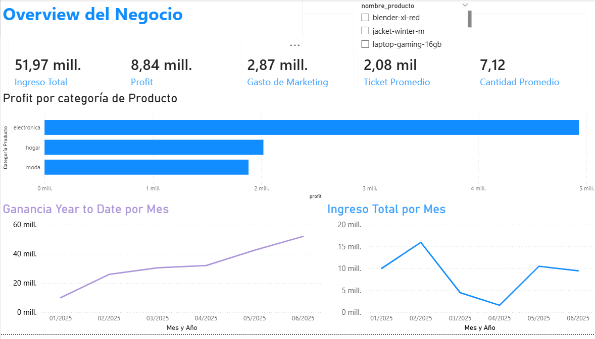

# Hi, I'm Diego Pastrana 👋

  

📊 Junior Data Analyst | ⚙️ Mechatronics & Robotics Engineer

---

## 🛠 Skills

- 📊 **Data Analysis:** Exploratory Data Analysis (EDA)
- 🐍 **Python:** Pandas, NumPy
- 🗄 **Databases:** SQL
- 📈 **Tools:** Excel, Google Sheets
- 🔧 **Version Control:** Git & GitHub
- ☁ **Cloud Fundamentals:** Azure basics
- 🧠 **Strengths:** Analytical thinking, attention to detail, structured problem solving

---

## 📊 Projects

### 📊 RappiPlus: Business Analytics & Dashboard | End-to-End Project

**🎯 Context or Problem**
Comprehensive evaluation of RappiPlus's commercial performance. The objective was to transform raw transactional, marketing, and user behavior data into actionable *insights* to identify opportunities for improving profitability, retention, and conversion.

**👨‍💻 My Contribution**
Developed the entire analytical workflow individually. I managed the complete data lifecycle: from initial extraction and cleaning to statistical hypothesis validation and the design of the final interactive dashboard.

**⚙️ Process and Decisions**
- **Data Preparation:** Centralized the cleaning of multiple data sources using **Python (Pandas and NumPy)** to ensure a scalable and replicable process.
- **Modeling & Metrics:** Structured the conversion funnel and cohort analysis using **SQL (PostgreSQL)**, prioritizing the accuracy of historical metrics.
- **Statistical Validation:** Evaluated the proposed *checkout* redesign through rigorous **A/B testing**, grounding product decisions in evidence.
- **Visualization:** Consolidated findings in **Power BI (DAX)**, designing a dashboard with executive and detail-level views tailored to different business profiles.

**🚀 Results and Learnings**
- 💰 **Finance:** Mapped **$9.62M** in revenue, **$2.92M** in net profit, and an average order value of **$385.88**.
- 📉 **Users:** Precisely identified critical drop-off points in the conversion funnel.
- 💡 **Business Impact:** The A/B test statistically demonstrated that the checkout redesign did not generate a significant improvement (*p = 0.416*), preventing a costly implementation with no real business impact.

**🔗 Evidence**
- Link to repository: https://github.com/Dydak811/rappi-plus-analytics-dashboard
- 📊 [Power BI: Interactive Dashboard]
-## Executive Overview

  
### 🚦 Urban Mobility & Economic Analysis (LATAM) | Python

Analysis of traffic congestion and economic indicators in Latin American cities using **Python (Pandas)** and **Jupyter Notebook**.  
Focused on **data cleaning, dataset merging, and exploratory data analysis (EDA).**

🔗 **Repository:**  
https://github.com/Dydak811/Urban-Mobility-Economic-Analysis-LATAM-Python-2025-

---

## About Me

I am a **Junior Data Analyst with a background in Mechatronics and Robotics Engineering**, focused on transforming data into actionable insights to support better decision-making.

I have experience in **data cleaning, exploratory data analysis, and data manipulation** using tools such as **Excel, SQL, and Python (Pandas, NumPy)**. I also work with **Google Sheets, GitHub, and have foundational knowledge of Azure**.

I am characterized by **analytical thinking, attention to detail, and a structured approach to solving problems and optimizing processes through data analysis.**

Currently, I am seeking opportunities as a **Junior Data Analyst, Business Data Analyst, or similar roles**, where I can contribute by analyzing data, generating insights, and helping organizations make data-driven decisions.

---

## 🚀 Currently

- 📚 Continuing to develop my **Data Analytics portfolio**
- 📊 Improving my skills in **Python, SQL, and data visualization**
- 🔍 Actively seeking **Junior Data Analyst opportunities**

---

## 🌐 Connect with me
## Diego de Jesús Pastrana Blanco
- 🔍 mail: diegopb811@gmail.com 
- 💼 LinkedIn:  
[linkedin.com/in/diego-pastrana](https://linkedin.com/in/diego-pastrana)

---
